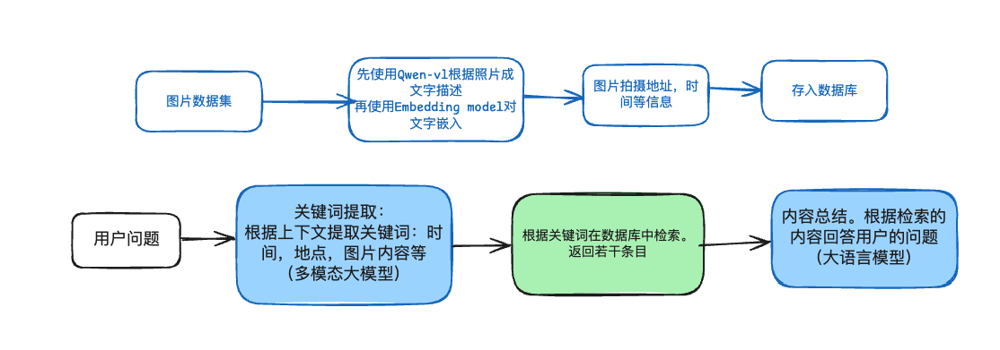

# Personal Photos Assistant

The project uses a multimodal large model to answer questions about the user's personal photo album.
Get the location, time and other information of the user's photos, and then use the multimodal large model to generate a detailed description for the picture.
After the information is embedded, it is stored in the vector database.

The multimodal large model determines whether the user's question involves aggregated questions and answers. If so, then use sql-like precise query, otherwise use es matching query. If the user's question contains pictures, the description of the picture, extract keywords.
Database retrieval
The large language model summarizes and answers based on the content of the retrieved pictures

## Flowchart
